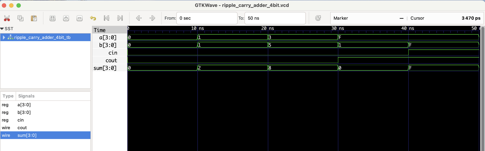

#  4-bit Ripple Carry Adder (Structural) - RTL Design

This project implements a **4-bit ripple carry adder** using four chained 1-bit full adders in structural Verilog.  
It adds two 4-bit binary numbers `a` and `b`, and an input carry `cin`, producing a 4-bit `sum` and a carry-out `cout`.

The structure illustrates how carry propagates (ripples) through chained full adder blocks.

## 🔗 Module Hierarchy
- `full_adder`: Basic 1-bit adder.
- `ripple_carry_adder_4bit`: Chains four `full_adder` modules.

## Files
- `ripple_carry_adder_4bit.v`: RTL module with structural design
- `ripple_carry_adder_4bit_tb.v`: Testbench
- `ripple_carry_adder_4bit.vcd`: Waveform file for GTKWave

## ▶️ To Simulate

```bash
iverilog -o rca4.out ripple_carry_adder_4bit.v ripple_carry_adder_4bit_tb.v
vvp rca4.out
gtkwave ripple_carry_adder_4bit.vcd
```

## 📊 Simulation Waveform

Here’s the output from GTKWave:

