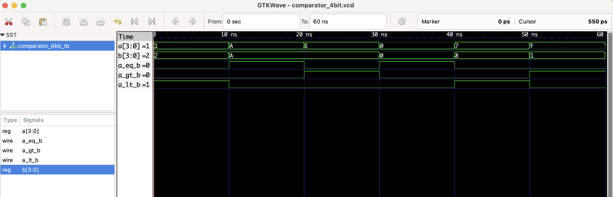

# 4-bit Comparator – RTL Design

This project implements a **4-bit digital comparator** in Verilog.  
It compares two 4-bit binary numbers `a` and `b`, and generates three outputs:
- `a_gt_b`: Set to 1 when `a > b`
- `a_eq_b`: Set to 1 when `a == b`
- `a_lt_b`: Set to 1 when `a < b`

Only one output will be high at a time.

## ✅ Truth Table Example

| a      | b      | a_gt_b | a_eq_b | a_lt_b |
|--------|--------|--------|--------|--------|
| 0001   | 0010   |   0    |   0    |   1    |
| 1010   | 1010   |   0    |   1    |   0    |
| 1110   | 1010   |   1    |   0    |   0    |

## Files
- `comparator_4bit.v`: RTL Verilog module
- `comparator_4bit_tb.v`: Testbench module
- `comparator_4bit.vcd`: VCD waveform output

## ▶️ To Simulate

```bash
iverilog -o comparator_4bit.out comparator_4bit.v comparator_4bit_tb.v
vvp comparator_4bit.out
gtkwave comparator_4bit.vcd
```
## 📊 Simulation Waveform

Here’s the output from GTKWave:

