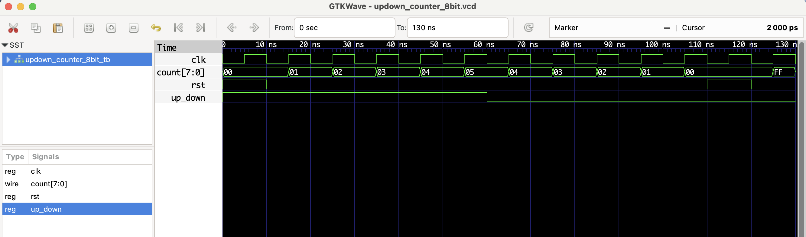

# 8-bit Up/Down Counter (Synchronous) - RTL Design

This project implements an **8-bit synchronous counter** that can count up or down based on the `up_down` control signal.

- When `up_down = 1`, it **counts up**.
- When `up_down = 0`, it **counts down**.
- `rst` resets the counter to 0 on the next rising edge of the clock.

## ✅ Functional Table

| clk ↑ | rst | up_down | count (next)         |
|-------|-----|---------|-----------------------|
|   ↑   |  1  |   X     | 0 (reset)             |
|   ↑   |  0  |   1     | count + 1 (up)        |
|   ↑   |  0  |   0     | count - 1 (down)      |

## Files
- `updown_counter_8bit.v`: RTL module
- `updown_counter_8bit_tb.v`: Testbench
- `updown_counter_8bit.vcd`: Waveform file for GTKWave

## ▶️ To Simulate

```bash
iverilog -o updown_counter_8bit.out updown_counter_8bit.v updown_counter_8bit_tb.v
vvp updown_counter_8bit.out
gtkwave updown_counter_8bit.vcd
```
## 📊 Simulation Waveform

Here’s the output from GTKWave:

