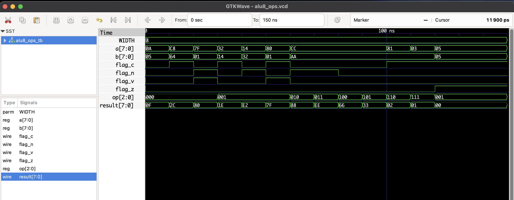

# ALU with 8 Operations (Level 2)

This project implements a parameterizable ALU that supports **8 operations** and produces standard status flags:
- **C** : Carry (unsigned carry-out for ADD; for SUB it's `~borrow` — set to 1 when no borrow)
- **Z** : Zero (result == 0)
- **V** : Overflow (signed overflow for ADD/SUB)
- **N** : Negative (result MSB — signed < 0)

## OpCode Map (3-bit)
| Opcode | Mnemonic | Meaning                |
|--------|----------|------------------------|
| 000    | ADD      | result = a + b         |
| 001    | SUB      | result = a - b         |
| 010    | AND      | result = a & b         |
| 011    | OR       | result = a \| b        |
| 100    | XOR      | result = a ^ b         |
| 101    | NOT      | result = ~a (b ignored)|
| 110    | SLL      | result = a << 1 (logical left) |
| 111    | SRL      | result = a >> 1 (logical right)|

## Parameters
- `WIDTH` — data width (default 8). The module is written parameterized so you can set it to 4, 8, 16, etc.

## Flags semantics
- **Carry (C)**
  - ADD: C = carry-out of MSB (1 if unsigned overflow)
  - SUB: `temp = {1'b0, a} - {1'b0, b}`; `temp[WIDTH] == 1` indicates borrow. We set `C = ~borrow` so `C==1` when no borrow (i.e., a >= b unsigned).
  - SLL: C = bit shifted out (MSB before shift)
  - SRL: C = LSB before shift
  - Logical operations: C = 0
- **Zero (Z)**: 1 when `result == 0`
- **Overflow (V)**: signed overflow for ADD/SUB using MSB sign-bit logic
- **Negative (N)**: MSB of result (signed negative indicator)

## Files
- `alu8_ops.v`       : RTL parameterized module
- `alu8_ops_tb.v`    : Testbench exercising operations and flags
- `alu8_ops.vcd`     : Waveform dump (generated after simulation)

## Simulation (Icarus Verilog)
```bash
iverilog -o alu8_ops.out alu8_ops.v alu8_ops_tb.v
vvp alu8_ops.out
gtkwave alu8_ops.vcd
```
## 🔍 Waveform Output

Here’s the output of the simulation viewed in GTKWave:

