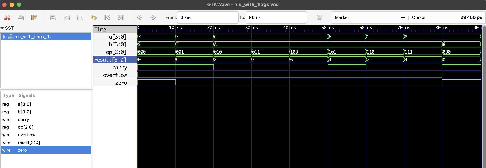

# 4-bit ALU with Flag Outputs – RTL Design

This project implements a 4-bit ALU that performs standard arithmetic and logic operations, and also outputs key **status flags**:

- `carry`: Indicates carry out from addition or shift
- `zero`: 1 when result is zero
- `overflow`: For signed overflow in ADD/SUB

---

## ⚙️ Supported Operations

| Op Code | Operation      | Description            |
|---------|----------------|------------------------|
| 000     | ADD            | a + b                  |
| 001     | SUB            | a - b                  |
| 010     | AND            | a & b                  |
| 011     | OR             | a \| b                 |
| 100     | XOR            | a ^ b                  |
| 101     | NOT            | ~a (ignores b)         |
| 110     | Shift Left     | a << 1                 |
| 111     | Shift Right    | a >> 1                 |

---

## 📘 Flag Behavior

- **Carry**: Set when result exceeds 4 bits (bit 4 = 1)
- **Zero**: Set when result == 0
- **Overflow**:
  - ADD: Set when signed overflow occurs
  - SUB: Set when result exceeds signed 4-bit range

---

## 🧪 Files

| File                 | Description            |
|----------------------|------------------------|
| `alu_with_flags.v`   | RTL design of the ALU  |
| `alu_with_flags_tb.v`| Testbench for simulation |
| `alu_with_flags.vcd` | GTKWave waveform dump  |

---

## ▶️ To Simulate

```bash
iverilog -o alu_with_flags.out alu_with_flags.v alu_with_flags_tb.v
vvp alu_with_flags.out
gtkwave alu_with_flags.vcd
```
## 🔍 Waveform Output

Here’s the output of the simulation viewed in GTKWave:

