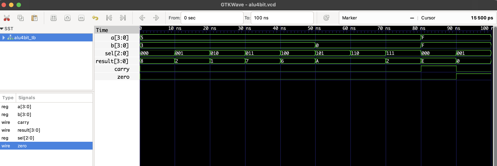

#  4-bit ALU – Arithmetic Logic Unit

This project implements a **4-bit Arithmetic Logic Unit (ALU)** in Verilog.  
The ALU supports common arithmetic and logic operations controlled by a 3-bit selector.

## ✅ Operations Table

| `sel` | Operation        | Description           |
|-------|------------------|-----------------------|
| 000   | ADD              | `result = a + b`      |
| 001   | SUB              | `result = a - b`      |
| 010   | AND              | `result = a & b`      |
| 011   | OR               | `result = a \| b`     |
| 100   | XOR              | `result = a ^ b`      |
| 101   | NOT              | `result = ~a`         |
| 110   | Shift Left       | `result = a << 1`     |
| 111   | Shift Right      | `result = a >> 1`     |

> Flags:
> - `carry`: 1 if operation overflows (only ADD/SUB)
> - `zero`: 1 if result == 0

## 📦 Files

- `alu4bit.v`: Verilog RTL module
- `alu4bit_tb.v`: Verilog testbench
- `alu4bit.vcd`: Waveform for GTKWave

## ▶️ Simulation (with Icarus Verilog)

```bash
iverilog -o alu4bit.out alu4bit.v alu4bit_tb.v
vvp alu4bit.out
gtkwave alu4bit.vcd
```
## 🔍 Waveform Output

Here’s the output of the simulation viewed in GTKWave:

