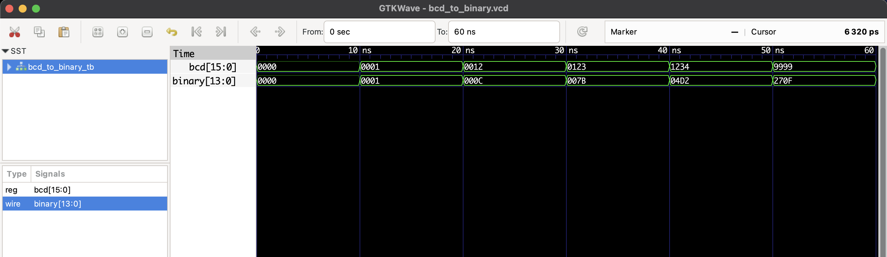

# BCD to Binary Converter - RTL Design

This project implements a **4-digit BCD to binary converter** in Verilog.  
It converts a 16-bit input representing four BCD digits into its equivalent 14-bit binary number.

| BCD Input (Hex) | Decimal Equivalent | Binary Output (Decimal) |
|-----------------|--------------------|------------------------|
| 0000            | 0                  | 0                      |
| 0001            | 1                  | 1                      |
| 0012            | 12                 | 12                     |
| 0123            | 123                | 123                    |
| 1234            | 1234               | 1234                   |
| 9999            | 9999               | 9999                   |

## Files
- `bcd_to_binary.v`: RTL module
- `bcd_to_binary_tb.v`: Testbench
- `bcd_to_binary.vcd`: Waveform file (for GTKWave)

## ▶️ To Simulate

```bash
iverilog -o bcd_to_binary.out bcd_to_binary.v bcd_to_binary_tb.v
vvp bcd_to_binary.out
gtkwave bcd_to_binary.vcd
```
## 🔍 Waveform Output

Here’s the output of the simulation viewed in GTKWave:

