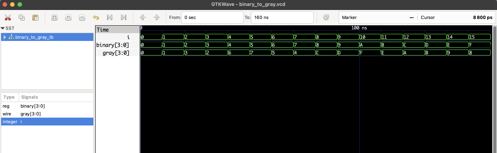

# Binary to Gray Code Converter – RTL Verilog

This project implements a **4-bit Binary to Gray Code converter** using simple bitwise logic.  
Gray code is useful in minimizing transition errors in digital systems such as encoders, counters, and communication protocols.

## 📦 Files

- `binary_to_gray.v`: RTL module
- `binary_to_gray_tb.v`: Testbench
- `binary_to_gray.vcd`: Waveform output for GTKWave

## ✅ Conversion Logic

Each bit in the Gray code is computed as:

| Gray[i] | Logic Expression             |
|---------|------------------------------|
| G[3]    | B[3]                          |
| G[2]    | B[3] XOR B[2]                |
| G[1]    | B[2] XOR B[1]                |
| G[0]    | B[1] XOR B[0]                |

## ▶️ Simulation Instructions

```bash
iverilog -o binary_to_gray.out binary_to_gray.v binary_to_gray_tb.v
vvp binary_to_gray.out
gtkwave binary_to_gray.vcd
```
## 🔍 Waveform Output

Here’s the output of the simulation viewed in GTKWave:

