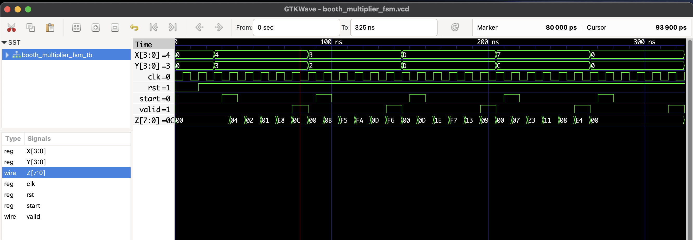

# Booth Multiplier FSM 

This project implements a simple **4-bit Booth multiplier FSM** in Verilog.

- Inputs:  
  - `X`, `Y`: 4-bit signed multiplicand and multiplier  
  - `start`: pulse signal to begin multiplication  
  - `clk`: clock  
  - `rst`: active low reset  

- Outputs:  
  - `Z`: 8-bit signed product  
  - `valid`: output high when the product is valid  

- The module uses two states: IDLE and START to implement Booth's multiplication algorithm.

- Multiplication begins when `start` is high on a clock edge.

- `valid` goes high when the multiplication is complete.
-----

## Files

- `booth_multiplier.v`: RTL module
- `booth_multiplier_tb.v`: Testbench
- `booth_multiplier.vcd`: Waveform dump

## To Simulate

```bash
iverilog -o boothmul.out booth_multiplier.v booth_multiplier_tb.v
vvp boothmul.out
gtkwave booth_multiplier.vcd
```

## 🔍 Waveform Output

Here’s the output of the simulation viewed in GTKWave:

