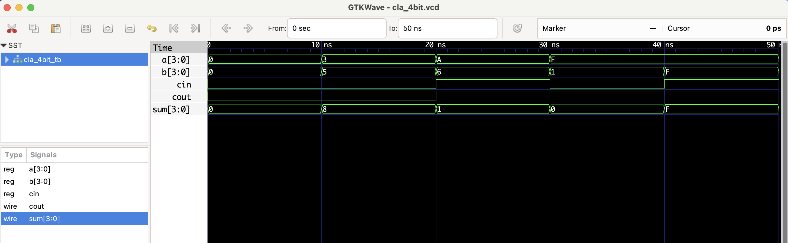

#  4-bit Carry Lookahead Adder (CLA) - RTL Design

## 📄 Description

This project implements a **4-bit Carry Lookahead Adder** in Verilog.  
Unlike a ripple carry adder, which propagates carry bit-by-bit, this design computes carry signals in parallel — greatly improving speed.

It uses generate (`g = a & b`) and propagate (`p = a ^ b`) logic to determine all carries in advance.

## ✅ Logic Summary
C1 = G0 + P0·Cin
C2 = G1 + P1·C1
C3 = G2 + P2·C2
Cout = G3 + P3·C3

## Files
- `cla_4bit.v`: RTL module
- `cla_4bit_tb.v`: Testbench
- `cla_4bit.vcd`: Waveform file for GTKWave

## ▶️ To Simulate

```bash
iverilog -o cla_4bit.out cla_4bit.v cla_4bit_tb.v
vvp cla_4bit.out
gtkwave cla_4bit.vcd
```
## 📊 Simulation Waveform

Here’s the output from GTKWave:

