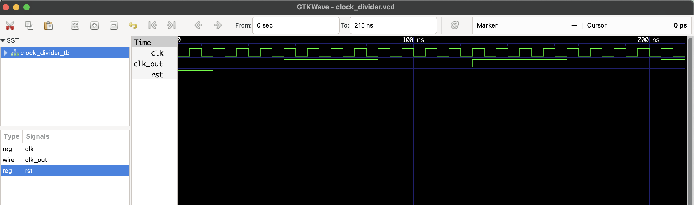

# ⏱ Clock Divider (Divide-by-4) – RTL Design

This project implements a **clock divider** using a 2-bit counter.

- **Divide-by-4**: The output `clk_out` toggles every 4 rising edges of the input `clk`.
- Used to generate slower clocks from fast base clocks (e.g., for timers, FSMs).


## 📂 Files

- `clock_divider.v`: RTL Verilog source
- `clock_divider_tb.v`: Testbench
- `clock_divider.vcd`: GTKWave simulation file

## ▶️ To Simulate

```bash
iverilog -o clock_divider.out clock_divider.v clock_divider_tb.v
vvp clock_divider.out
gtkwave clock_divider.vcd
```
## 🔍 Waveform Output

Here’s the output of the simulation viewed in GTKWave:

