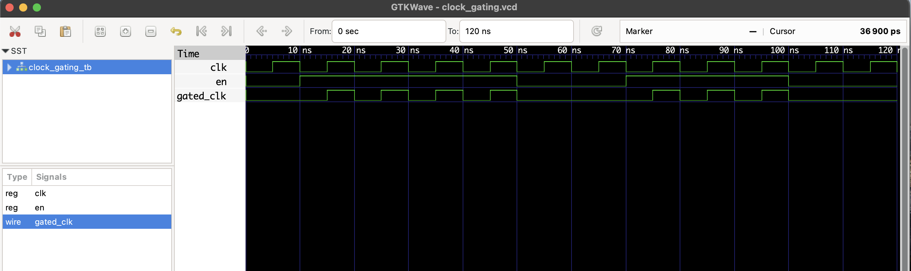

# Clock Gating Circuit – RTL Design

This project implements a **clock gating circuit** in Verilog to reduce power consumption by disabling the clock when not needed.

---

## 📘 Description

Clock gating is a low-power technique used in digital circuits to **stop the clock** for certain parts of a design when they are idle, preventing unnecessary switching activity.

This implementation is a **basic AND-based clock gating** for demonstration purposes.

---

## 🗂 Files
- `clock_gating.v` – RTL module
- `clock_gating_tb.v` – Testbench
- `clock_gating.vcd` – Waveform file

---

## ▶️ To Simulate

```bash
iverilog -o clock_gating.out clock_gating.v clock_gating_tb.v
vvp clock_gating.out
gtkwave clock_gating.vcd
```

## 🔍 Waveform Output

Here’s the output of the simulation viewed in GTKWave:

