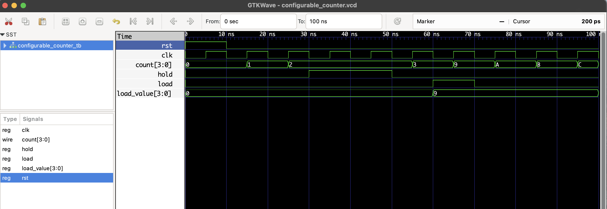

# Configurable Counter – 4-bit RTL Verilog Design

This is a 4-bit synchronous configurable counter implemented in Verilog.  
It supports:

| Signal | Function                          |
|--------|-----------------------------------|
| `rst`  | Reset counter to 0                |
| `load` | Load specific value to counter    |
| `hold` | Freeze counter value              |
| `clk`  | Clock input                       |
| `count`| Current counter value (4 bits)    |

## 📁 Files

- `configurable_counter.v`: RTL module
- `configurable_counter_tb.v`: Testbench
- `configurable_counter.vcd`: Waveform for GTKWave

## ▶️ Simulation Steps

```bash
iverilog -o configurable_counter.out configurable_counter.v configurable_counter_tb.v
vvp configurable_counter.out
gtkwave configurable_counter.vcd
```
---
## 🧠 How It Works:

| Time | Action            | Counter Output |
|------|-------------------|----------------|
| 0ns  | Reset active      | 0              |
| 10ns | Count starts      | 0 → 1 → ...    |
| 30ns | Hold active       | Freezes        |
| 50ns | Load = 9          | count = 9      |
| 60ns | Continues         | 10 → 11 ...    |
---
## 🔍 Waveform Output

Here’s the output of the simulation viewed in GTKWave:

