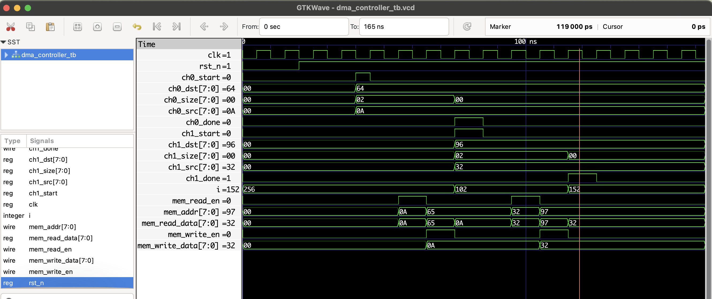

# DMA Controller (2 Channels)

## Overview

This project implements a simple **Direct Memory Access (DMA) Controller** with two independent channels that transfer data between memory locations without CPU intervention. The DMA controller autonomously moves data blocks efficiently, freeing CPU resources.

---

## Features

- Supports **2 independent channels** (Channel 0 and Channel 1).
- Each channel transfers a configurable number of bytes from a source to a destination address.
- Sequentially processes channel requests with simple arbitration.
- Signals `ch0_done` and `ch1_done` indicate completion of transfers.
- Simple memory interface with read and write enables, address, and data signals.
- Synchronous operation with a system clock and asynchronous active-low reset.
- Debug messages inside the FSM for easy simulation tracing.


## How It Works

1. The DMA controller monitors the `start` signals of each channel.
2. When a channel start is detected, it latches the source address, destination address, and size.
3. It performs memory reads from the source and writes to the destination for the specified size.
4. After completing the transfer, it asserts the `done` signal for that channel.
5. The controller then waits for new start signals.

## Project Files

| Filename              | Description                                      |
|-----------------------|------------------------------------------------|
| `dma_controller.v`    | Verilog source code |
| `dma_controller_tb.v` | Verilog testbench  |
| `dma_controller_tb.vcd` | Waveform dump file |

## To Simulate

```bash
iverilog -o dma_controller_tb.vvp dma_controller.v dma_controller_tb.v
vvp dma_controller_tb.vvp
gtkwave dma_controller_tb.vcd
```
 ## 🔍 Waveform Output

Here’s the output of the simulation viewed in GTKWave:

