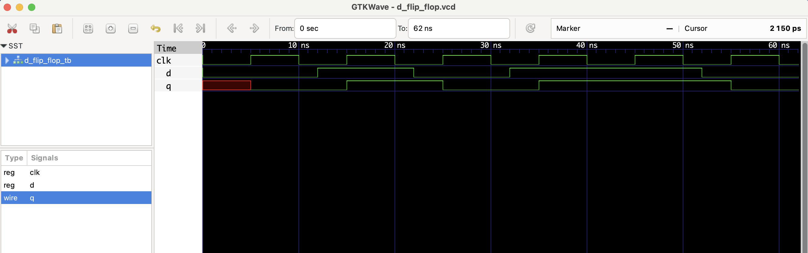

# D Flip-Flop – RTL Design

This project implements a **positive edge-triggered D Flip-Flop** in Verilog.

- Stores the value of input `d` at each **rising edge of the clock**.
- Output `q` holds the stored value until the next rising edge.

### 🔁 Timing Behavior

| Clock ↑ | D | Q (next) |
|---------|---|----------|
|   ↑     | 0 |    0     |
|   ↑     | 1 |    1     |
|   ↑     | 0 |    0     |

## Files
- `d_flip_flop.v`: RTL module
- `d_flip_flop_tb.v`: Testbench
- `d_flip_flop.vcd`: Waveform file

## ▶️ To Simulate

```bash
iverilog -o d_flip_flop.out d_flip_flop.v d_flip_flop_tb.v
vvp d_flip_flop.out
gtkwave d_flip_flop.vcd
```
 ## 🔍 Waveform Output

Here’s the output of the simulation viewed in GTKWave:

