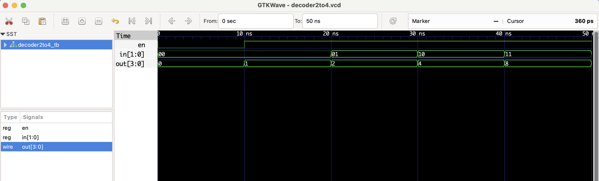

# 🔧 2:4 Decoder - RTL Design

This project implements a **2-to-4 decoder** in Verilog.  
It takes a 2-bit input `in` and a 1-bit enable `en`. If `en` is high, one of the 4 output lines will be set high based on the value of `in`.

| en | in  | out    |
|----|-----|--------|
| 0  | xx  | 0000   |
| 1  | 00  | 0001   |
| 1  | 01  | 0010   |
| 1  | 10  | 0100   |
| 1  | 11  | 1000   |

## Files
- `decoder2to4.v`: RTL module
- `decoder2to4_tb.v`: Testbench
- `decoder2to4.vcd`: Waveform file (for GTKWave)

## ▶️ To Simulate

```bash
iverilog -o decoder2to4.out decoder2to4.v decoder2to4_tb.v
vvp decoder2to4.out
gtkwave decoder2to4.vcd
```
 ## 🔍 Waveform Output

Here’s the output of the simulation viewed in GTKWave:

