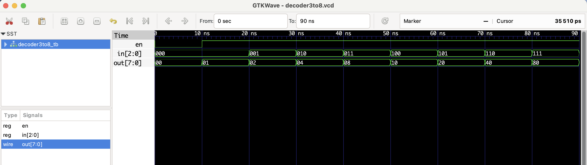

# 🔧 3:8 Decoder - RTL Design

This project implements a **3-to-8 decoder** in Verilog.  
It takes a 3-bit binary input `in` and a 1-bit enable `en`. When `en = 1`, one of the eight output lines goes high depending on `in`.

| en | in  | out       |
|----|-----|-----------|
| 0  | xxx | 00000000  |
| 1  | 000 | 00000001  |
| 1  | 001 | 00000010  |
| 1  | 010 | 00000100  |
| 1  | 011 | 00001000  |
| 1  | 100 | 00010000  |
| 1  | 101 | 00100000  |
| 1  | 110 | 01000000  |
| 1  | 111 | 10000000  |

## Files
- `decoder3to8.v`: RTL module
- `decoder3to8_tb.v`: Testbench
- `decoder3to8.vcd`: Waveform file (for GTKWave)

## ▶️ To Simulate

```bash
iverilog -o decoder3to8.out decoder3to8.v decoder3to8_tb.v
vvp decoder3to8.out
gtkwave decoder3to8.vcd
```
 ## 🔍 Waveform Output

Here’s the output of the simulation viewed in GTKWave:

