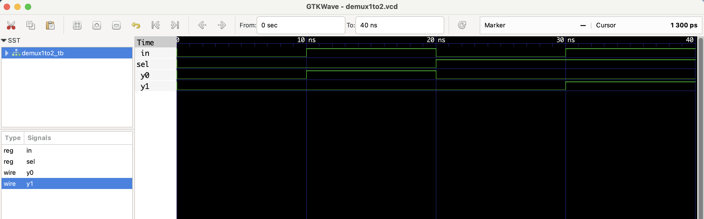

# 🔧 1:2 Demultiplexer - RTL Design


This project implements a **1-to-2 demultiplexer** in Verilog.  
It routes the single input `in` to either output `y0` or `y1` based on the select line `sel`.

| sel | in | y0 | y1 |
|-----|-----|----|----|
|  0  |  1  | 1  | 0  |
|  1  |  1  | 0  | 1  |

## Files
- `demux1to2.v`: RTL module
- `demux1to2_tb.v`: Testbench
- `demux1to2.vcd`: Waveform file (for GTKWave)

## ▶️ To Simulate

```bash
iverilog -o demux1to2.out demux1to2.v demux1to2_tb.v
vvp demux1to2.out
gtkwave demux1to2.vcd
```
 ## 🔍 Waveform Output

Here’s the output of the simulation viewed in GTKWave:

