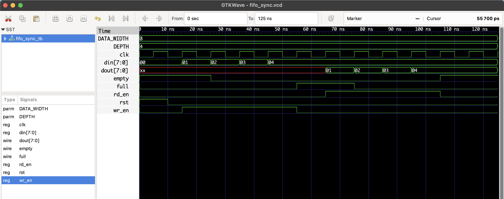

# Configurable FIFO (Sync) – RTL Design

This project implements a fully synchronous FIFO queue in Verilog with **configurable width and depth**.  
The FIFO supports **write and read operations**, along with `full` and `empty` status flags.

---

## 🔧 Parameters

| Parameter    | Description             | Default |
|--------------|-------------------------|---------|
| `DATA_WIDTH` | Width of each data word | 8       |
| `DEPTH`      | FIFO queue depth        | 8       |

---

## 📘 Ports

| Port     | Direction | Description                   |
|----------|-----------|-------------------------------|
| `clk`    | Input     | Clock                         |
| `rst`    | Input     | Reset (active high)           |
| `wr_en`  | Input     | Write enable                  |
| `rd_en`  | Input     | Read enable                   |
| `din`    | Input     | Data input                    |
| `dout`   | Output    | Data output                   |
| `full`   | Output    | High when FIFO is full        |
| `empty`  | Output    | High when FIFO is empty       |

---

## ▶️ Simulation Instructions

```bash
iverilog -o fifo_sync.out fifo_sync.v fifo_sync_tb.v
vvp fifo_sync.out
gtkwave fifo_sync.vcd
```

## 🔍 Waveform Output

Here’s the output of the simulation viewed in GTKWave:

