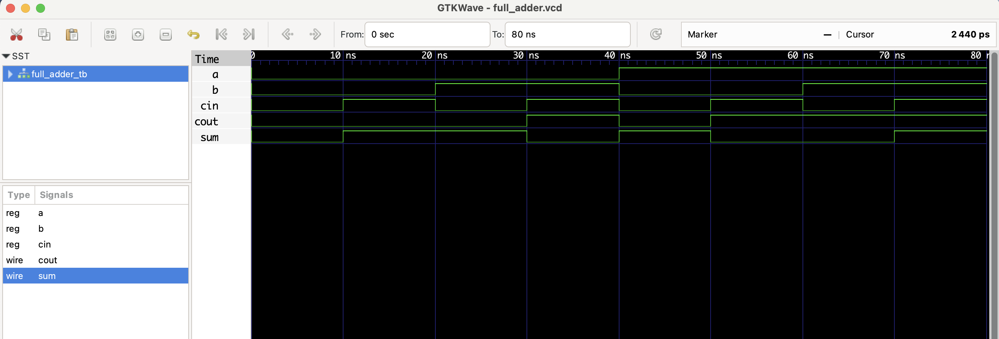

# 🔧 Full Adder - RTL Design

A **Full Adder** is a combinational circuit that adds three 1-bit binary numbers: inputs `a`, `b`, and `cin` (carry-in).  
It produces a 1-bit `sum` and a 1-bit `cout` (carry-out).

| a | b | cin | sum | cout |
|---|---|-----|-----|------|
| 0 | 0 |  0  |  0  |  0   |
| 0 | 0 |  1  |  1  |  0   |
| 0 | 1 |  0  |  1  |  0   |
| 0 | 1 |  1  |  0  |  1   |
| 1 | 0 |  0  |  1  |  0   |
| 1 | 0 |  1  |  0  |  1   |
| 1 | 1 |  0  |  0  |  1   |
| 1 | 1 |  1  |  1  |  1   |

## Files
- `full_adder.v`: RTL module
- `full_adder_tb.v`: Testbench
- `full_adder.vcd`: Waveform file (for GTKWave)

## ▶️ To Simulate

```bash
iverilog -o full_adder.out full_adder.v full_adder_tb.v
vvp full_adder.out
gtkwave full_adder.vcd
```
# 🔍 Waveform Output

Here’s the output of the simulation viewed in GTKWave:

