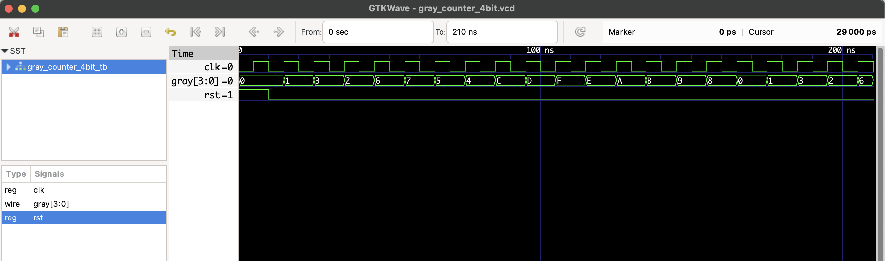

# 4-bit Gray Code Counter – RTL Design

This project implements a **4-bit Gray Code Counter** in Verilog.

- Gray Code: only **one bit changes** between successive states.
- Reduces errors in digital logic, especially in encoders and ADCs.
- Converts a binary up-counter to Gray code with this formula: gray = binary ^ (binary >> 1)

## 📊 Gray Code Mapping

| Decimal | Binary | Gray  |
|---------|--------|-------|
| 0       | 0000   | 0000  |
| 1       | 0001   | 0001  |
| 2       | 0010   | 0011  |
| 3       | 0011   | 0010  |
| 4       | 0100   | 0110  |
| 5       | 0101   | 0111  |
| 6       | 0110   | 0101  |
| 7       | 0111   | 0100  |
| 8       | 1000   | 1100  |
| 9       | 1001   | 1101  |
| 10      | 1010   | 1111  |
| 11      | 1011   | 1110  |
| 12      | 1100   | 1010  |
| 13      | 1101   | 1011  |
| 14      | 1110   | 1001  |
| 15      | 1111   | 1000  |

## 📂 Files

- `gray_counter_4bit.v`: Verilog RTL code
- `gray_counter_4bit_tb.v`: Testbench
- `gray_counter_4bit.vcd`: GTKWave simulation file

## ▶️ To Simulate

```bash
iverilog -o gray_counter_4bit.out gray_counter_4bit.v gray_counter_4bit_tb.v
vvp gray_counter_4bit.out
gtkwave gray_counter_4bit.vcd
```
## 🔍 Waveform Output

Here’s the output of the simulation viewed in GTKWave:

