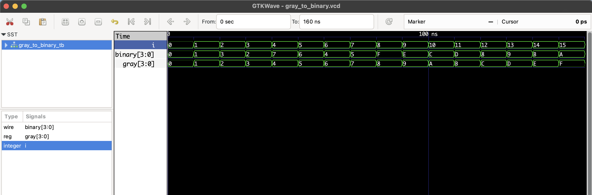

# Gray to Binary Converter – RTL Verilog

This project implements a **4-bit Gray to Binary converter**.  
Gray codes differ by only 1 bit between values, which helps in noise-sensitive transitions (e.g., encoders, counters).  
We convert Gray code to Binary using XOR chaining logic.

## 📦 Files

- `gray_to_binary.v`: RTL module
- `gray_to_binary_tb.v`: Testbench
- `gray_to_binary.vcd`: Waveform file for GTKWave

## 🔁 Conversion Logic

| Binary[i] | Expression                            |
|-----------|----------------------------------------|
| B[3]      | G[3]                                   |
| B[2]      | G[3] XOR G[2]                          |
| B[1]      | B[2] XOR G[1]                          |
| B[0]      | B[1] XOR G[0]                          |

## ▶️ Simulate with Icarus Verilog

```bash
iverilog -o gray_to_binary.out gray_to_binary.v gray_to_binary_tb.v
vvp gray_to_binary.out
gtkwave gray_to_binary.vcd
```
## 🔍 Waveform Output

Here’s the output of the simulation viewed in GTKWave:

