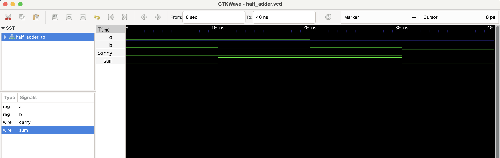

# 🔧 Half Adder - RTL Design

A **Half Adder** is a basic combinational circuit used in digital logic that adds two 1-bit binary numbers (`a` and `b`) and produces a 1-bit `sum` and a 1-bit `carry`.

| a | b | sum | carry |
|---|---|-----|-------|
| 0 | 0 |  0  |   0   |
| 0 | 1 |  1  |   0   |
| 1 | 0 |  1  |   0   |
| 1 | 1 |  0  |   1   |

## Files
- `half_adder.v`: RTL module
- `half_adder_tb.v`: Testbench
- `half_adder.vcd`: Waveform file (for GTKWave)

## ▶️ To Simulate

```bash
iverilog -o half_adder.out half_adder.v half_adder_tb.v
vvp half_adder.out
gtkwave half_adder.vcd
```
## 🔍 Waveform Output

Here’s the output of the simulation viewed in GTKWave:

