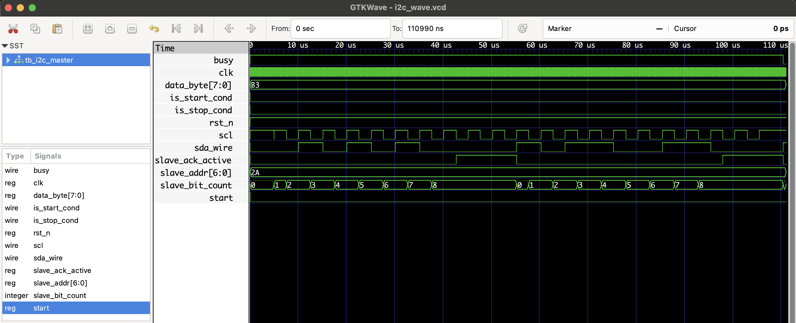

# I2C Master Protocol - RTL Design

## Overview

This project contains a simple I2C Master controller. It can:
- Generate standard I2C start and stop conditions
- Transmit 7-bit slave addresses and 8-bit data bytes
- Wait for and handle slave acknowledgements (ACK)
- Control SDA and SCL lines with open-drain behavior

The testbench simulates a basic I2C slave that acknowledges the address and data bytes, allowing for functional verification.

---

## Files

| Filename       | Description                               |
|----------------|-------------------------------------------|
| `i2c_master.v` | Verilog module implementing I2C Master    |
| `tb_i2c_master.v` | Testbench simulating master and slave behavior |
| `i2c_wave.vcd` | Waveform file generated after simulation  |

---

## Signals Description

### Inputs

| Signal       | Description                     |
|--------------|---------------------------------|
| `clk`        | System clock (e.g., 50 MHz)     |
| `rst_n`      | Active-low synchronous reset    |
| `start`      | Pulse to start a transaction    |
| `slave_addr` | 7-bit slave device address      |
| `data_byte`  | 8-bit data byte to write        |

### Outputs

| Signal   | Description                        |
|----------|-----------------------------------|
| `busy`   | High while I2C transaction active |
| `sda`    | Bidirectional I2C data line (open-drain) |
| `scl`    | I2C clock line                    |

---

## To Simulate

```bash
iverilog -o i2c_master_tb.vvp i2c_master.v tb_i2c_master.v
vvp i2c_master_tb.vvp
gtkwave i2c_wave.vcd
```
## 🔍 Waveform Output

Here’s the output of the simulation viewed in GTKWave:


