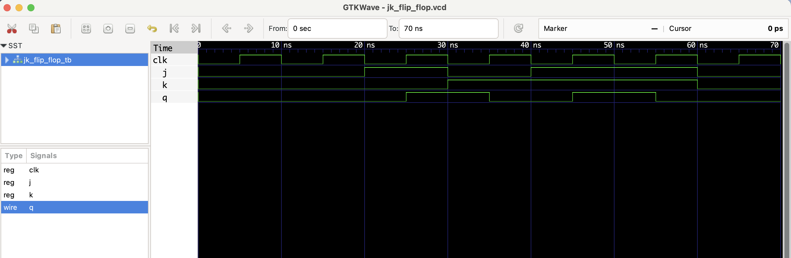

# JK Flip-Flop – RTL Design

This project implements a **JK Flip-Flop** in Verilog. It is an edge-triggered sequential device with the following behavior:

| J | K | Q (next) |
|---|---|----------|
| 0 | 0 |   Q      |
| 0 | 1 |   0      |
| 1 | 0 |   1      |
| 1 | 1 |  ~Q      |

## Files
- `jk_flip_flop.v`: JK Flip-Flop Verilog module
- `jk_flip_flop_tb.v`: Testbench module
- `jk_flip_flop.vcd`: VCD waveform for GTKWave

## ▶️ To Simulate

```bash
iverilog -o jk_flip_flop.out jk_flip_flop.v jk_flip_flop_tb.v
vvp jk_flip_flop.out
gtkwave jk_flip_flop.vcd
```
## 🔍 Waveform Output

Here’s the output of the simulation viewed in GTKWave:

