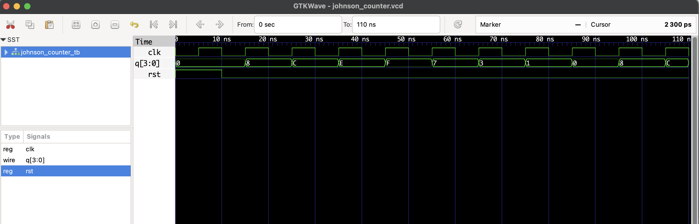

# 🔄 4-bit Johnson Counter – RTL Design

This project implements a **4-bit Johnson Counter** in Verilog.

- A type of shift register where the inverted last bit is fed back to the first bit.
- It produces **2n unique states** using `n` flip-flops.
- The state pattern:  
  `0000 → 1000 → 1100 → 1110 → 1111 → 0111 → 0011 → 0001 → 0000`

## Files

- `johnson_counter.v`: RTL Verilog source
- `johnson_counter_tb.v`: Testbench
- `johnson_counter.vcd`: Waveform file for GTKWave

## ▶️ To Simulate

```bash
iverilog -o johnson_counter.out johnson_counter.v johnson_counter_tb.v
vvp johnson_counter.out
gtkwave johnson_counter.vcd
```
## 🔍 Waveform Output

Here’s the output of the simulation viewed in GTKWave:

