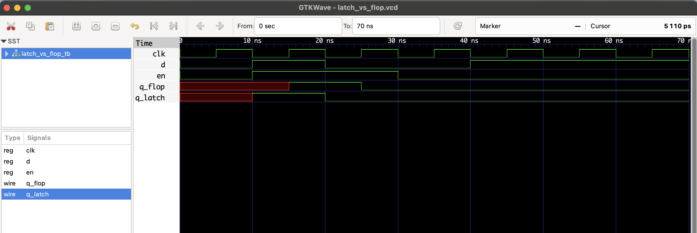

# Latch vs Flop Detector – RTL Verification Project (Icarus-Compatible)

This project demonstrates how to detect **unintended latch behavior** in Verilog by comparing two designs:
- `q_latch`: A signal implemented using a **latch** (level-sensitive)
- `q_flop`: A signal implemented using a **flip-flop** (edge-triggered)

The goal is to highlight issues caused by incomplete conditional assignments in combinational logic that result in inferred latches.

---

## 📘 Concept

| Signal     | Description                      |
|------------|----------------------------------|
| `q_latch`  | Uses `always @(*)`, may infer latch |
| `q_flop`   | Uses `always @(posedge clk)`, proper flip-flop |
| `en`       | Control signal (enable)          |
| `d`        | Input data                       |
| `clk`      | Clock signal                     |

---

## ⚠️ Latch Detection Method

Instead of SystemVerilog assertions (not supported by Icarus), we manually monitor and analyze:

- `q_latch` changing when `en == 0` and `d` is stable → **suspected latch**
- `q_flop` should only change on rising clock edge and when `en == 1`

These behaviors are verified by inspecting waveforms or `$display` logs.

## 🧪 Files

- `latch_vs_flop.v`: RTL module with both latch and flop
- `latch_vs_flop_tb.sv`: Testbench with stimulus
- `latch_vs_flop.vcd`: Waveform for GTKWave

## ▶️ To Simulate

```bash
iverilog -o latch_vs_flop.out latch_vs_flop.v latch_vs_flop_tb.v
vvp latch_vs_flop.out
gtkwave latch_vs_flop.vcd
```

## 🔍 Waveform Output

Here’s the output of the simulation viewed in GTKWave:

