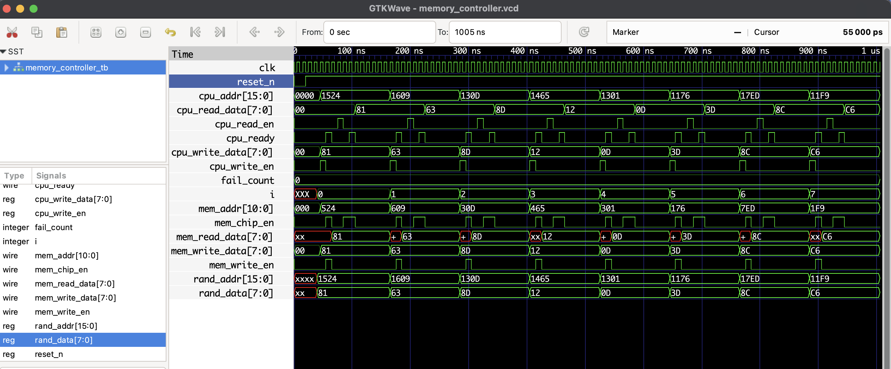

# Memory Controller (Verilog)

## Overview
This project implements a **simple synchronous memory controller** with a CPU interface and memory interface.  
It handles **read** and **write** cycles with a finite state machine (FSM) and ensures proper data latching for stable reads.
---

## Features
- Parameterized data and address widths
- Base address and address range decoding
- FSM-controlled read and write cycles
- Separate **read setup** and **read wait** states to ensure stable data
- Fully self-checking testbench

---

## Memory Controller FSM
| State       | Description |
|-------------|-------------|
| `IDLE`      | Wait for CPU request |
| `WRITE_CYCLE` | Write data to memory, assert ready |
| `READ_SETUP`  | Assert CE, prepare read |
| `READ_WAIT`   | Latch memory data, assert ready |

---

## CPU Interface
| Signal           | Dir   | Description |
|------------------|-------|-------------|
| `cpu_addr`       | In    | Address from CPU |
| `cpu_write_data` | In    | Data to write |
| `cpu_read_en`    | In    | Read enable |
| `cpu_write_en`   | In    | Write enable |
| `cpu_read_data`  | Out   | Data read from memory |
| `cpu_ready`      | Out   | Transaction completion flag |

---

## Memory Interface
| Signal            | Dir   | Description |
|-------------------|-------|-------------|
| `mem_addr`        | Out   | Address to memory |
| `mem_write_data`  | Out   | Data to memory |
| `mem_read_data`   | In    | Data from memory |
| `mem_write_en`    | Out   | Write enable |
| `mem_chip_en`     | Out   | Chip enable |

---

## Files
- `memory_controller.v` — The main memory controller
- `memory_controller_tb.v` — Testbench with a simple RAM model
- `memory_controller.vcd` - waveform for GTKWave

## To Simulate
```bash
iverilog -o mem_ctrl_tb.vvp memory_controller.v memory_controller_tb.v
vvp mem_ctrl_tb.vvp
gtkwave memory_controller.vcd
```
 ## 🔍 Waveform Output

Here’s the output of the simulation viewed in GTKWave:

