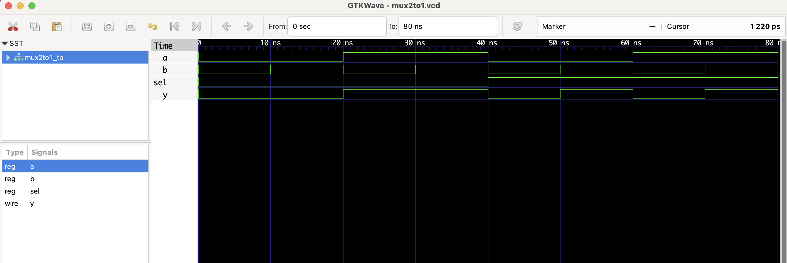

# 🔧 2:1 Multiplexer - RTL Design


A simple 2:1 multiplexer selects between two 1-bit inputs `a` and `b` based on a select line `sel`. If `sel` is 0, output is `a`; else it is `b`.

## Files
- `mux2to1.v`: RTL module
- `mux2to1_tb.v`: Testbench
- `mux2to1.vcd`: Waveform file (for GTKWave)

## ▶️ To Simulate

```bash
iverilog -o mux2to1.out mux2to1.v mux2to1_tb.v
vvp mux2to1.out
gtkwave mux2to1.vcd
```
 ## 🔍 Waveform Output

Here’s the output of the simulation viewed in GTKWave:

