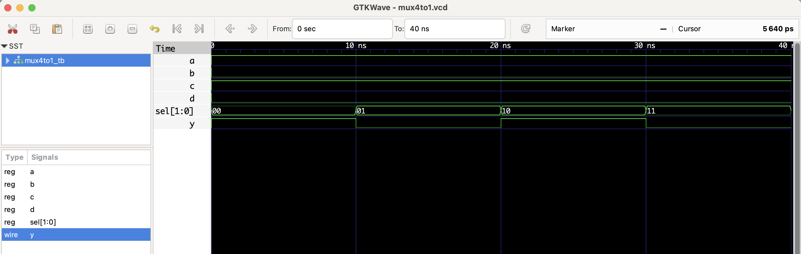

# 🔧 4:1 Multiplexer - RTL Design

This project implements a 4-to-1 multiplexer using Verilog.  
It selects one of the 1-bit inputs `a`, `b`, `c`, or `d` based on a 2-bit `sel` input and routes it to the output `y`.

## Files
- `mux4to1.v`: RTL module
- `mux4to1_tb.v`: Testbench
- `mux4to1.vcd`: Waveform file (for GTKWave)

## ▶️ To Simulate

```bash
iverilog -o output.out mux4to1.v mux4to1_tb.v
vvp mux4to1.out
gtkwave mux4to1.vcd
```
 ## 🔍 Waveform Output

Here’s the output of the simulation viewed in GTKWave:

