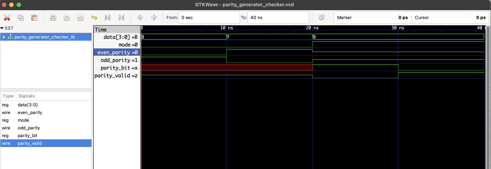

# 🧮 Parity Generator and Checker – RTL Verilog

This Verilog project implements both a **Parity Bit Generator** and a **Parity Checker** using XOR logic. It supports:

- 4-bit input `data`
- Generates **even** and **odd** parity
- Verifies parity correctness in **checking mode**

## ⚙️ Modes of Operation

| `mode` | Operation   |
|--------|-------------|
| 0      | Generate    |
| 1      | Check       |

## 📁 Files

- `parity_generator_checker.v`: RTL module
- `parity_generator_checker_tb.v`: Testbench
- `parity_generator_checker.vcd`: GTKWave output

## ▶️ Simulation Instructions

```bash
iverilog -o parity_generator_checker.out parity_generator_checker.v parity_generator_checker_tb.v
vvp parity_generator_checker.out
gtkwave parity_generator_checker.vcd
```
## 🔍 Waveform Output

Here’s the output of the simulation viewed in GTKWave:

