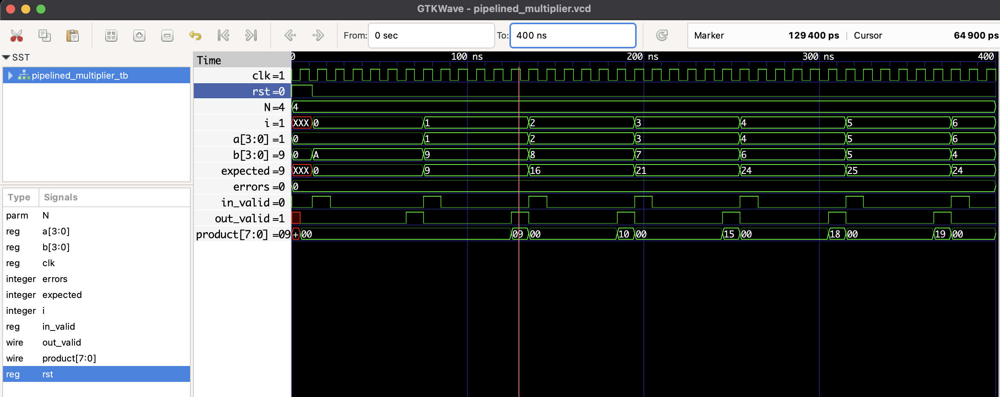

# Pipelined Multiplier (N x N) - RTL

A parameterized, synchronous **pipelined multiplier**. Default is a 4×4 multiplier (`N = 4`).  
The design accepts a new (A,B) pair every clock cycle (`in_valid`) and returns the `product` after `N` cycles (pipeline latency = `N`). Output is accompanied by `out_valid`.

## Ports

- `clk` — Clock (rising-edge synchronous)
- `rst` — Synchronous reset (active high)
- `in_valid` — Assert when `a` and `b` are valid this cycle
- `a`, `b` — Operands (N bits each)
- `product` — (2N bits) multiplication result
- `out_valid` — 1 when `product` is valid

## Files

- `pipelined_multiplier.v` — RTL (parameter `N`)
- `pipelined_multiplier_tb.v` — Testbench
- `pipelined_multiplier.vcd` — Waveform (generated by TB)

## How to simulate (Icarus Verilog + GTKWave)

```bash
iverilog -o pipemul.out pipelined_multiplier.v pipelined_multiplier_tb.v
vvp pipemul.out
gtkwave pipelined_multiplier.vcd
```
## 🔍 Waveform Output

Here’s the output of the simulation viewed in GTKWave:



## Quick explanation / debugging tips

- Latency = `N`. To see the first product, feed an input and watch the output `N` cycles later.
- If `product` is `X` or not matching:
  - Ensure `in_valid` is asserted when you load inputs (the testbench does this).
  - Ensure `rst` is deasserted before you start inputs.
  - Use GTKWave to add internal signals (if you change RTL) like `sum_reg[]`, `b_pipe[]`, `a_pipe[]`.
- To increase throughput to larger bit widths, raise `N` parameter in both RTL and TB