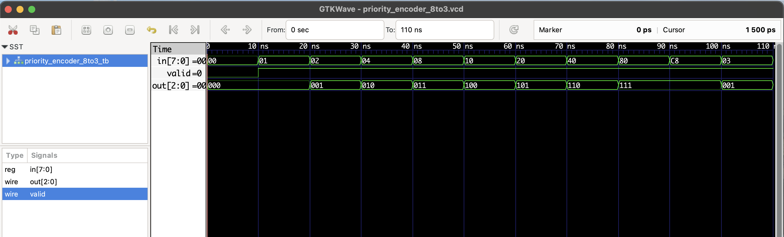

# 8:3 Priority Encoder - RTL Design

This project implements an **8:3 Priority Encoder** in Verilog.  
It outputs a 3-bit binary code corresponding to the highest-priority active input (bit 7 = highest, bit 0 = lowest).

## 📘 Truth Table (Single Input Active)

| Input (`in`)      | Output (`out`) | Valid |
|-------------------|----------------|-------|
| 00000001          | 000            | 1     |
| 00000010          | 001            | 1     |
| 00000100          | 010            | 1     |
| 00001000          | 011            | 1     |
| 00010000          | 100            | 1     |
| 00100000          | 101            | 1     |
| 01000000          | 110            | 1     |
| 10000000          | 111            | 1     |
| 00000000          | 000            | 0     |

When **multiple inputs** are active, the encoder chooses the **highest-priority one (MSB wins)**.

## Files

- `priority_encoder_8to3.v`: RTL module
- `priority_encoder_8to3_tb.v`: Testbench
- `priority_encoder_8to3.vcd`: Waveform output

## ▶️ To Simulate

```bash
iverilog -o priority_encoder_8to3.out priority_encoder_8to3.v priority_encoder_8to3_tb.v
vvp priority_encoder_8to3.out
gtkwave priority_encoder_8to3.vcd
```

## 🔍 Waveform Output

Here’s the output of the simulation viewed in GTKWave:

