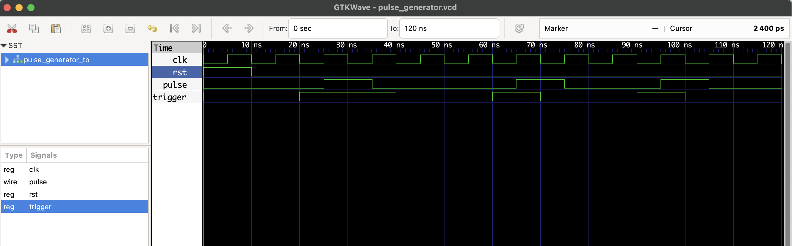

# Pulse Generator – RTL Design

## 📄 Description

This project implements a **pulse generator** in Verilog.

- Generates a **one-clock-cycle pulse** when the `trigger` input transitions from 0 to 1.
- Commonly used for **edge detection**, control signals, and handshaking.

## ✅ Truth Table

| clk edge | trigger | pulse |
|----------|---------|--------|
| ↑        | 0 → 1   | 1      |
| ↑        | 1       | 0      |
| ↑        | 0       | 0      |

## 📂 Files

- `pulse_generator.v`: RTL Verilog code
- `pulse_generator_tb.v`: Testbench
- `pulse_generator.vcd`: Waveform dump file

## ▶️ To Simulate

```bash
iverilog -o pulse_generator.out pulse_generator.v pulse_generator_tb.v
vvp pulse_generator.out
gtkwave pulse_generator.vcd
```
## 🔍 Waveform Output

Here’s the output of the simulation viewed in GTKWave:


