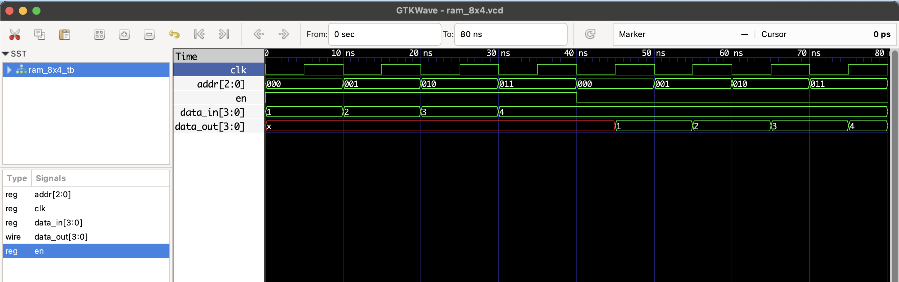

# 8x4 RAM - RTL Design

This project implements an **8x4 RAM (Random Access Memory)** module in Verilog.

- **Read/Write** control via `en` (Write Enable)
- **Clocked behavior**: All operations happen on the rising edge of `clk`
- **Addressable space**: 8 locations (3-bit address)
- **Data size**: 4 bits per location

## 📘 Control Logic

| clk ↑ | we  | Operation  | Description             |
|-------|-----|------------|-------------------------|
| Yes   | 1   | Write      | Store `data_in` at `addr` |
| Yes   | 0   | Read       | Output value at `addr`   |

## Files

- `ram_8x4.v`: RTL module
- `ram_8x4_tb.v`: Testbench
- `ram_8x4.vcd`: GTKWave file

## ▶️ To Simulate

```bash
iverilog -o ram_8x4.out ram_8x4.v ram_8x4_tb.v
vvp ram_8x4.out
gtkwave ram_8x4.vcd
```
## 🔍 Waveform Output

Here’s the output of the simulation viewed in GTKWave:

