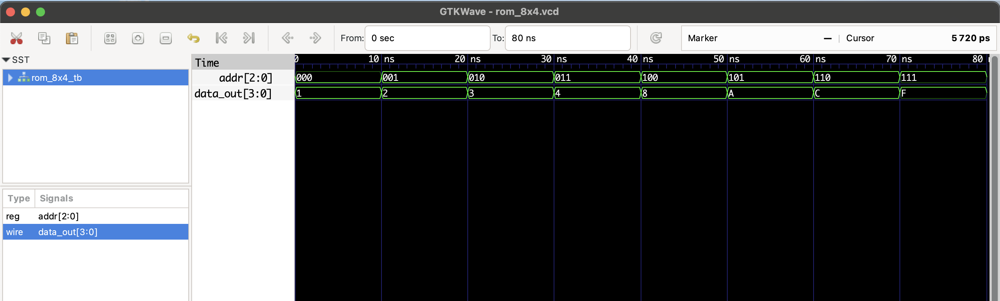

# 8x4 ROM - RTL Design

This project implements a simple **8x4 Read-Only Memory (ROM)** in Verilog.

- **Address**: 3-bit input (`addr`) selects one of 8 locations (0 to 7)
- **Data**: 4-bit output (`data_out`) returns hardcoded values from memory

## 📦 Memory Contents

| Address | Binary | Data Output |
|---------|--------|-------------|
|   0     | 000    | 0001        |
|   1     | 001    | 0010        |
|   2     | 010    | 0011        |
|   3     | 011    | 0100        |
|   4     | 100    | 1000        |
|   5     | 101    | 1010        |
|   6     | 110    | 1100        |
|   7     | 111    | 1111        |

## Files

- `rom_8x4.v`: RTL module
- `rom_8x4_tb.v`: Testbench
- `rom_8x4.vcd`: Waveform file for GTKWave

## ▶️ To Simulate

```bash
iverilog -o rom_8x4.out rom_8x4.v rom_8x4_tb.v
vvp rom_8x4.out
gtkwave rom_8x4.vcd
```

## 🔍 Waveform Output

Here’s the output of the simulation viewed in GTKWave:

