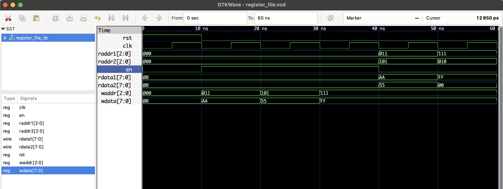

# Register File – RTL Design

This project implements a **Basic Register File** with:
- 8 registers (8-bit wide)
- 1 write port
- 2 read ports
- Reset clears all registers

### Functional Table

| en | waddr | wdata | Action         |
|----|-------|-------|----------------|
| 1  | 3     | 0xAA  | Writes 0xAA to R3 |
| 0  | 3     |  —    | R3 available for read |

## 📦 Files

- `register_file.v`: RTL module
- `register_file_tb.v`: Testbench
- `register_file.vcd`: Waveform file

## ▶️ To Simulate

```bash
iverilog -o register_file.out register_file.v register_file_tb.v
vvp register_file.out
gtkwave register_file.vcd
```

## 🔍 Waveform Output

Here’s the output of the simulation viewed in GTKWave:


