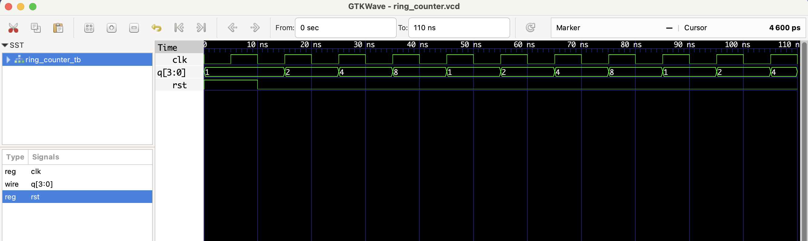

# 4-bit Ring Counter – RTL Design

This project implements a **4-bit ring counter** in Verilog.

- A single '1' bit rotates through the 4-bit register.
- On each rising edge of the clock, the '1' moves to the next bit.
- Reset initializes it to `0001`.

### 🧠 Working:
- Cycle 1: 0001
- Cycle 2: 0010
- Cycle 3: 0100
- Cycle 4: 1000
- Cycle 5: 0001 (repeats)

## Files
- `ring_counter.v`: Verilog module
- `ring_counter_tb.v`: Testbench
- `ring_counter.vcd`: Waveform file for GTKWave

## ▶️ To Simulate

```bash
iverilog -o ring_counter.out ring_counter.v ring_counter_tb.v
vvp ring_counter.out
gtkwave ring_counter.vcd
```
 ## 🔍 Waveform Output

Here’s the output of the simulation viewed in GTKWave:

