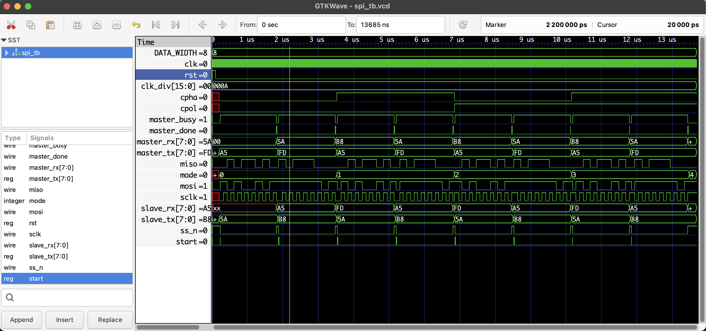

# SPI Master-Slave Verilog Project

## Overview

This project implements an SPI (Serial Peripheral Interface) communication system in Verilog, consisting of a parameterizable SPI Master and SPI Slave module with support for all SPI modes (mode 0 to mode 3), defined by CPOL and CPHA parameters.

- **SPI Master (`spi_master.v`)**:  
  - Parameterizable data width (default 8 bits).  
  - Supports SPI modes 0, 1, 2, and 3 via `cpol` and `cpha` inputs.  
  - Generates SCLK, MOSI, SS signals, handles transmission and reception of one byte per transaction.  
  - Provides handshake signals: `start`, `busy`, and `done`.

- **SPI Slave (`spi_slave.v`)**:  
  - Parameterizable data width matching master.  
  - Supports SPI modes 0 to 3.  
  - Responds to SCLK and SS signals, shifts data in and out synchronously with master.

- **Testbench (`spi_tb.v`)**:  
  - Instantiates both master and slave modules.  
  - Runs tests for all four SPI modes.  
  - Prints transmission results.  
  - Generates waveform file (`spi_tb.vcd`) for GTKWave visualization.

---

## SPI Protocol Basics

SPI uses four main signals:

| Signal | Direction             | Description                     |
|--------|-----------------------|---------------------------------|
| SCLK   | Output (Master → Slave) | Serial clock generated by master |
| MOSI   | Output (Master → Slave) | Master Out Slave In data line   |
| MISO   | Output (Slave → Master) | Master In Slave Out data line   |
| SS_N   | Output (Master → Slave) | Slave select (active low)       |

The clock polarity (`CPOL`) and phase (`CPHA`) define the SPI mode:

| Mode | CPOL | CPHA | Description                 |
|------|------|------|-----------------------------|
| 0    | 0    | 0    | Idle low, sample on rising edge (leading edge)  |
| 1    | 0    | 1    | Idle low, sample on falling edge (trailing edge)|
| 2    | 1    | 0    | Idle high, sample on falling edge (leading edge)|
| 3    | 1    | 1    | Idle high, sample on rising edge (trailing edge) |

---

## Files

| Filename       | Description                           |
|----------------|-------------------------------------|
| `spi_master.v` | Parameterizable SPI Master module    |
| `spi_slave.v`  | Parameterizable SPI Slave module     |
| `spi_tb.v`     | Testbench to simulate Master+Slave  |

---

## How It Works

### Master (`spi_master.v`)

- Uses the system clock (`clk`) and a clock divider (`clk_div`) to generate the SPI clock (`sclk`) at the desired speed.
- `start` signal triggers a transmission of a single byte (`tx_byte`).
- `ss_n` goes low to select the slave.
- MOSI line outputs the bits of `tx_byte` synchronized with `sclk`.
- Samples incoming data from MISO into `rx_byte`.
- Signals `busy` during transmission, and `done` for one cycle after completion.
- Handles CPOL/CPHA modes by controlling clock edges for data sampling and shifting.

### Slave (`spi_slave.v`)

- Listens to the `sclk` and `ss_n` signals.
- Loads its transmit byte (`tx_byte`) when `ss_n` goes low.
- Shifts data out on MISO and shifts data in from MOSI according to SPI timing rules for the configured CPOL/CPHA.
- Captures received data in `rx_byte` at the end of the transaction (when `ss_n` goes high).

### Testbench (`spi_tb.v`)

- Provides a 100 MHz system clock.
- Initializes master and slave with test patterns.
- Runs tests for all four SPI modes by setting `cpol` and `cpha`.
- For each mode, sends two test patterns from master and slave.
- Waits for transaction to complete (`done` signal).
- Prints results showing data sent and received on both sides.
- Dumps waveform to `spi_tb.vcd` for viewing with GTKWave.

---


## ▶️ To Simulate
```bash
iverilog -o spi_sim spi_master.v spi_slave.v spi_tb.v
vvp spi_sim
gtkwave spi_tb.vcd
```
## 🔍 Waveform Output

Here’s the output of the simulation viewed in GTKWave:

