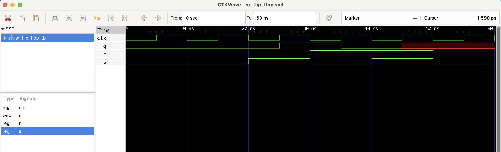

# SR Flip-Flop – RTL Design

This project implements a **Set-Reset (SR) Flip-Flop** in Verilog.

- `S = 1, R = 0` → Q is Set to 1
- `S = 0, R = 1` → Q is Reset to 0
- `S = 0, R = 0` → No Change
- `S = 1, R = 1` → Invalid state (X)

| clk ↑ | S | R | Q (next) |
|-------|---|---|----------|
|   ↑   | 0 | 0 |    Q     |
|   ↑   | 1 | 0 |    1     |
|   ↑   | 0 | 1 |    0     |
|   ↑   | 1 | 1 |    X     |

## Files
- `sr_flip_flop.v`: Verilog module
- `sr_flip_flop_tb.v`: Testbench
- `sr_flip_flop.vcd`: Waveform file

## ▶️ To Simulate

```bash
iverilog -o sr_flip_flop.out sr_flip_flop.v sr_flip_flop_tb.v
vvp sr_flip_flop.out
gtkwave sr_flip_flop.vcd
```
 ## 🔍 Waveform Output

Here’s the output of the simulation viewed in GTKWave:

