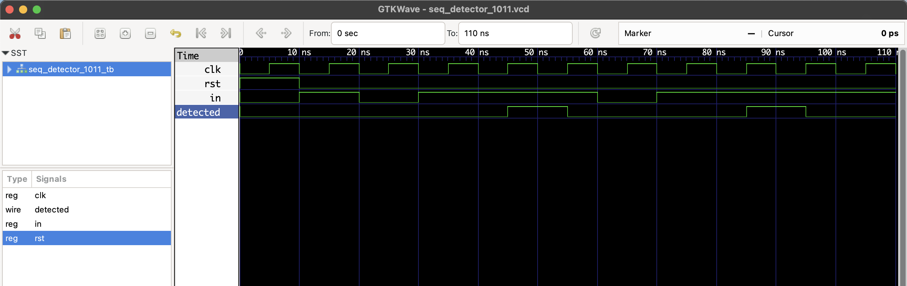

# 🔍 Sequence Detector (1011) – RTL FSM Design (Moore)

This project implements a **Moore Finite State Machine (FSM)** in Verilog that detects the **binary sequence `1011`** from a serial input stream.

- ✅ Output becomes `1` only when the full sequence `1011` is detected.
- ✅ Overlapping sequences are allowed. Example: `1011011` will trigger two detections.
- ✅ Designed using Verilog-2005 compatible `parameter`-based FSM coding.

### 💡 Example Timing
- Input   : 1 0 1 1 1 0 1 1
- Output  : 0 0 0 1 0 0 0 1

## 🧠 FSM Design

This is a **Moore FSM**, where the output depends only on the **current state**, not the current input.

**States:**

| State | Meaning     |
|-------|-------------|
| S0    | Idle        |
| S1    | Saw `1`     |
| S2    | Saw `10`    |
| S3    | Saw `101`   |
| S4    | Saw `1011`  |

## 📁 Files

- `seq_detector_1011.v`: Verilog RTL for sequence detector
- `seq_detector_1011_tb.v`: Testbench to verify functionality
- `seq_detector_1011.vcd`: Output waveform for GTKWave

## ▶️ To Simulate

Run the following commands in your terminal (Mac/Linux):

```bash
iverilog -o seq_detector_1011.out seq_detector_1011.v seq_detector_1011_tb.v
vvp seq_detector_1011.out
gtkwave seq_detector_1011.vcd
```
## 🔍 Waveform Output

Here’s the output of the simulation viewed in GTKWave:

