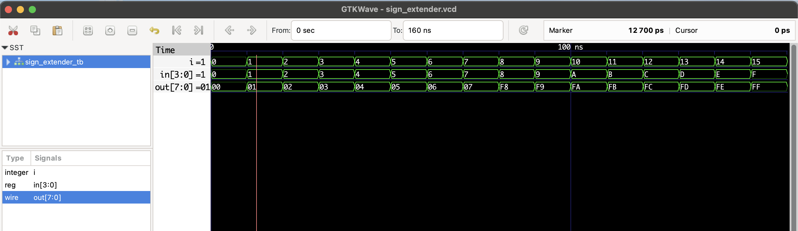

# Sign Extender – RTL Design

This project implements a **4-bit to 8-bit sign extender** using Verilog.  
It preserves the sign (MSB) when extending a signed 4-bit number to 8 bits.

For example:

| Input (4-bit) | MSB | Output (8-bit) |
|---------------|-----|----------------|
| `0101` (+5)   | 0   | `00000101`     |
| `1010` (−6)   | 1   | `11111010`     |

## 📦 Files

- `sign_extender.v`: RTL module
- `sign_extender_tb.v`: Testbench
- `sign_extender.vcd`: Waveform file

## ▶️ To Simulate

```bash
iverilog -o sign_extender.out sign_extender.v sign_extender_tb.v
vvp sign_extender.out
gtkwave sign_extender.vcd
```
## 🔍 Waveform Output

Here’s the output of the simulation viewed in GTKWave:


