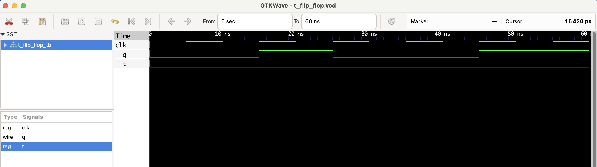

# T Flip-Flop – RTL Design

This project implements a **T (Toggle) Flip-Flop** in Verilog.

- On the rising edge of the clock:
  - If `T = 1`, output `Q` toggles (flips).
  - If `T = 0`, output `Q` holds its value.

This is a commonly used flip-flop in counters and sequential circuits.

## ✅ Behavior Table

| clk ↑ | T | Q (next) |
|-------|---|----------|
|   ↑   | 0 |   Q      |
|   ↑   | 1 |  ~Q      |

## Files
- `t_flip_flop.v`: RTL Verilog module
- `t_flip_flop_tb.v`: Testbench module
- `t_flip_flop.vcd`: VCD waveform file

## ▶️ To Simulate

```bash
iverilog -o t_flip_flop.out t_flip_flop.v t_flip_flop_tb.v
vvp t_flip_flop.out
gtkwave t_flip_flop.vcd
```
## 🔍 Waveform Output

Here’s the output of the simulation viewed in GTKWave:

