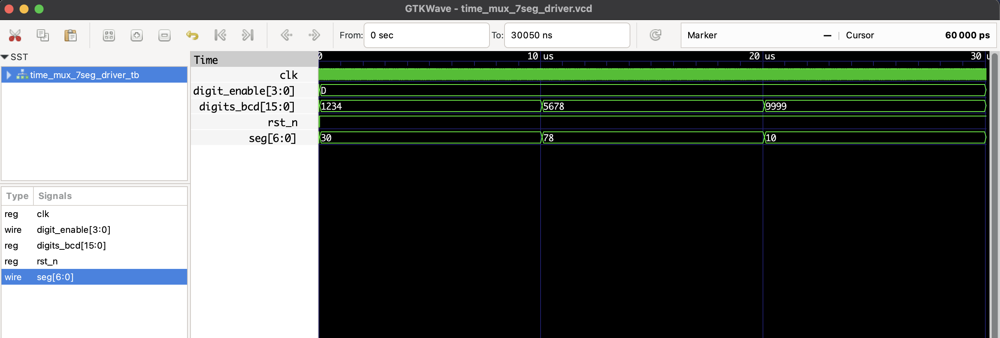

# Time-Multiplexed 7-Segment Display Driver - RTL Design

This project implements a **time-multiplexed 4-digit 7-segment display driver** in Verilog.

## Features

- Drives four 7-segment displays by rapidly cycling through digits
- Uses a 50 MHz clock and divides it down to ~1 kHz refresh rate
- Supports 4 BCD digits as input (`digits_bcd`), each 4 bits
- Active low digit enable signals for common-cathode displays
- 7-segment segment signals (a-g)

## Files

- `time_mux_7seg_driver.v`: RTL module  
- `time_mux_7seg_driver_tb.v`: Testbench  
- `time_mux_7seg_driver.vcd`: Waveform file (for GTKWave)  

## 7-Segment Encoding Table

| Digit | Segments (abcdefg) | Binary 7-bit |
|-------|--------------------|--------------|
| 0     | 0 0 0 0 0 0 1      | 1000000      |
| 1     | 1 1 1 1 0 0 1      | 1111001      |
| 2     | 0 1 0 0 1 0 0      | 0100100      |
| 3     | 0 1 1 0 0 0 0      | 0110000      |
| 4     | 1 0 1 1 0 0 1      | 0011001      |
| 5     | 1 0 0 1 0 0 0      | 0010010      |
| 6     | 0 0 0 1 0 0 0      | 0000010      |
| 7     | 1 1 1 0 0 0 1      | 1111000      |
| 8     | 0 0 0 0 0 0 0      | 0000000      |
| 9     | 1 0 1 1 0 0 0      | 0010000      |

## ▶️ To Simulate

```bash
iverilog -o time_mux_7seg_driver.out time_mux_7seg_driver.v time_mux_7seg_driver_tb.v
vvp time_mux_7seg_driver.out
gtkwave time_mux_7seg_driver.vcd
```
## 🔍 Waveform Output

Here’s the output of the simulation viewed in GTKWave:

