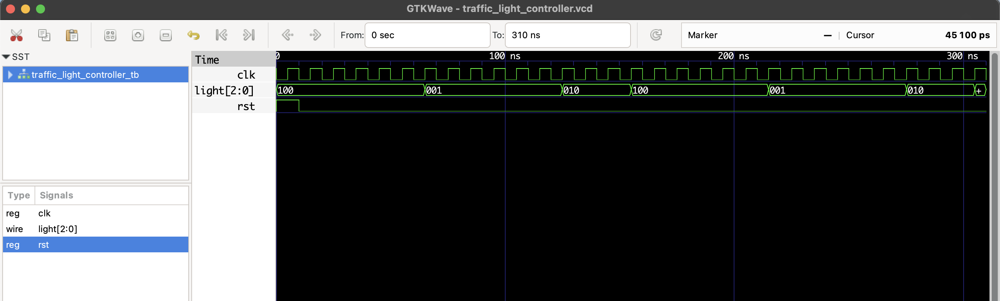

# 🚦 Traffic Light Controller – FSM RTL Design
This Verilog project simulates a **traffic light controller** using a **Finite State Machine (FSM)** with three main states:

- 🔴 **RED** (lights[2] = 1)
- 🟡 **YELLOW** (lights[1] = 1)
- 🟢 **GREEN** (lights[0] = 1)

The controller switches states based on internal timing using a clock counter:
- Red for 6 cycles
- Green for 6 cycles
- Yellow for 3 cycles

## 📁 Files

- `traffic_light_controller.v`: RTL Verilog module
- `traffic_light_controller_tb.v`: Testbench
- `traffic_light_controller.vcd`: Waveform file for GTKWave

## ▶️ Simulation Steps

```bash
iverilog -o traffic_light_controller.out traffic_light_controller.v traffic_light_controller_tb.v
vvp traffic_light_controller.out
gtkwave traffic_light_controller.vcd
```
## 🔍 Waveform Output

Here’s the output of the simulation viewed in GTKWave:

