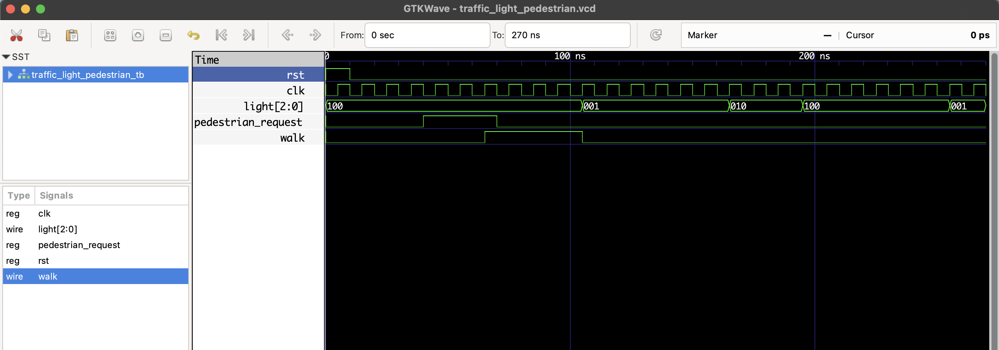

# 🚥 Traffic Light Controller with Pedestrian Override

This project implements a traffic signal controller using an FSM that handles:
- Red, Yellow, Green lights
- A **pedestrian button** to request crossing
- A `walk` signal that appears when the system is in RED and detects a request

### 🚶 Pedestrian Behavior

- A pedestrian can request a crossing anytime by setting `pedestrian_request = 1`.
- The FSM checks for the request at the end of a RED state.
- If detected, it stays in RED and activates the `walk` signal for 3 clock cycles.

## 📁 Files

- `traffic_light_pedestrian.v`: RTL FSM module
- `traffic_light_pedestrian_tb.v`: Testbench
- `traffic_light_pedestrian.vcd`: GTKWave waveform output

## ▶️ To Simulate

```bash
iverilog -o traffic_light_pedestrian.out traffic_light_pedestrian.v traffic_light_pedestrian_tb.v
vvp traffic_light_pedestrian.out
gtkwave traffic_light_pedestrian.vcd
```
## 🔍 Waveform Output

Here’s the output of the simulation viewed in GTKWave:

