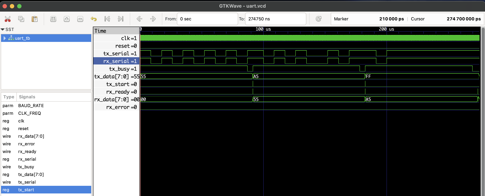

# UART Transmitter and Receiver in Verilog

This project implements a simple UART transmitter and receiver in Verilog with the following features:

- Asynchronous UART communication with:
  - 1 Start bit (logic 0)
  - 8 Data bits (LSB first)
  - 1 Stop bit (logic 1)
  - No parity bit
- Configurable baud rate and clock frequency parameters
- Simple testbench with TX-RX loopback for simulation

## Parameters

- `CLK_FREQ`: System clock frequency (Hz). Default is 50 MHz.
- `BAUD_RATE`: UART baud rate. Default is 115200 bps.

## Files
- `uart_tx.v`: UART Transmitter RTL
- `uart_rx.v`: UART Receiver RTL
- `uart_tb.v`: Testbench (Tx looped back to Rx)
- `uart.vcd`: Waveform file (GTKWave)

## ▶️ To Simulate
```bash
iverilog -o uart.out uart_tx.v uart_rx.v uart_tb.v
vvp uart.out
gtkwave uart.vcd
```

## 🔍 Waveform Output

Here’s the output of the simulation viewed in GTKWave:

