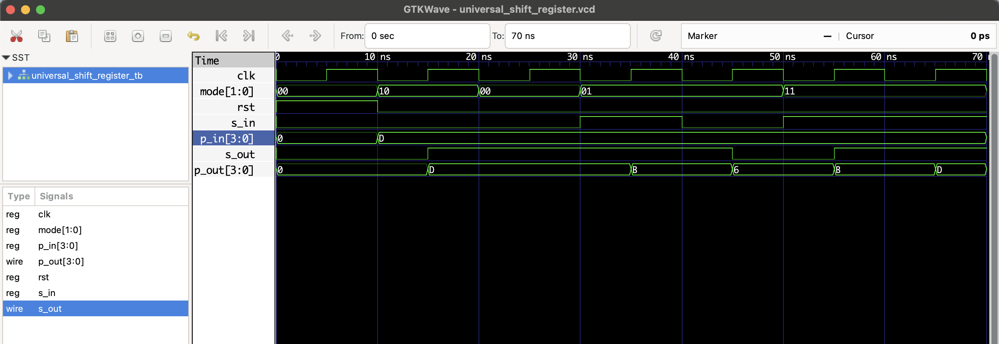

# Universal 4-bit Shift Register - RTL Design

This project implements a **universal 4-bit shift register** in Verilog, capable of:

- **SISO** (Serial-In Serial-Out)
- **SIPO** (Serial-In Parallel-Out)
- **PISO** (Parallel-In Serial-Out)
- **PIPO** (Parallel-In Parallel-Out)

## 📘 Modes

| Mode | Name         | Description                    |
|------|--------------|--------------------------------|
| 00   | Hold         | Register holds its state       |
| 01   | Shift Left   | Serial in → LSB, shift left    |
| 10   | Load Parallel| Load 4-bit input directly       |
| 11   | Shift Right  | Serial in → MSB, shift right   |

## 🧪 Test Sequence

1. **Reset**
2. **Load `1101` in parallel (PIPO)**
3. **Hold state**
4. **Shift left with serial in `1` then `0` (SIPO)**
5. **Shift right with serial in `1` twice (PISO)**

## Files

- `universal_shift_register.v`: RTL module
- `universal_shift_register_tb.v`: Testbench
- `universal_shift_register.vcd`: Waveform dump

## ▶️ To Simulate

```bash
iverilog -o universal_shift_register.out universal_shift_register.v universal_shift_register_tb.v
vvp universal_shift_register.out
gtkwave universal_shift_register.vcd
```
## 🔍 Waveform Output

Here’s the output of the simulation viewed in GTKWave:

