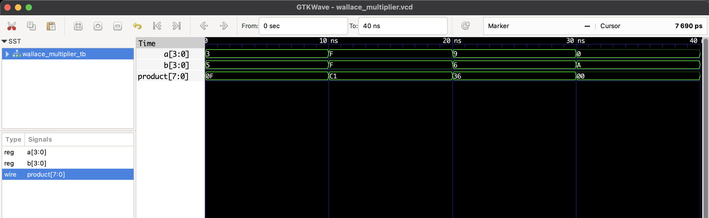

#  Wallace Tree Multiplier (4x4) – RTL Design

This project implements a **4x4 Wallace Tree Multiplier** in Verilog.  
It uses a fast tree-based reduction method for partial products, reducing propagation delay compared to simple array multipliers.

**Wallace Tree Steps:**
1. Generate partial products.
2. Compress partial products using carry-save addition.
3. Propagate final carry to produce the product.

## 📊 Example Output Table

| A    | B    | Product |
|------|------|---------|
| 3    | 5    | 15      |
| 15   | 15   | 225     |
| 9    | 6    | 54      |

## 🗂 Files
- `wallace_multiplier.v` – RTL code 
- `wallace_multiplier_tb.v` – Testbench 
- `wallace_multiplier.vcd` – Waveform dump for GTKWave 

## To Simulate
```bash
iverilog -o wallace_multiplier.out wallace_multiplier.v wallace_multiplier_tb.v
vvp wallace_multiplier.out
gtkwave wallace_multiplier.vcd
```
## 🔍 Waveform Output

Here’s the output of the simulation viewed in GTKWave:


