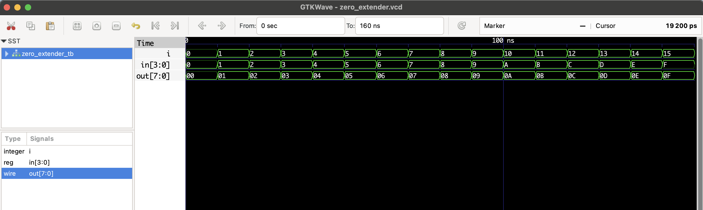

# Zero Extender – RTL Design
This Verilog project implements a **Zero Extender**, which extends a 4-bit binary number to 8 bits by padding the most significant bits (MSBs) with zeros.

It’s used when unsigned values need to be passed into larger datapaths or registers.

## 📦 Files

- `zero_extender.v`: RTL module
- `zero_extender_tb.v`: Testbench
- `zero_extender.vcd`: Simulation waveform

## ▶️ To Simulate

```bash
iverilog -o zero_extender.out zero_extender.v zero_extender_tb.v
vvp zero_extender.out
gtkwave zero_extender.vcd
```

## 🔍 Waveform Output

Here’s the output of the simulation viewed in GTKWave:


